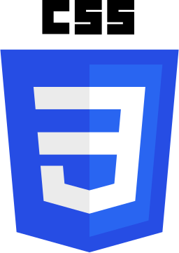
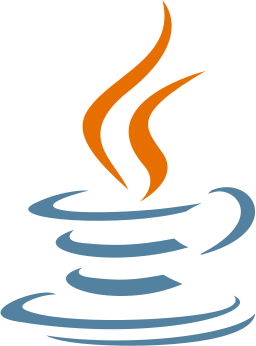
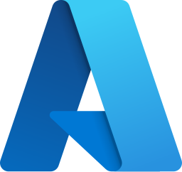
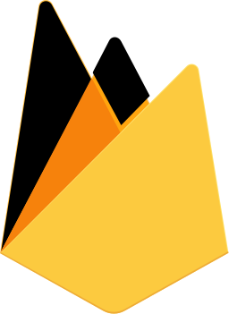
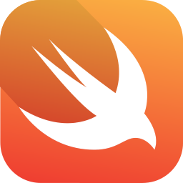

 

  

 

## 👤 Contact

 

 

  

 

  

 

## 💻 Full Stack Experience

### 🔎 Front

  
  
  
  
  
  

### 🌐 Back

  
  
  
  
  

### 🗄 Database

  
  
  

### 📈 DevOps

  
  
  
  

### 📱 Other

  
  
  
  
  
  

 

## 🎯 About me

 

- 🌱 `Continuous Learning & Development`

- 🔭 `Observability & Monitoring`

- 👯 `Collaboration & Teamwork`

- 🤔 `Problem Solving & Debugging`

- 💬 `Communication & Documentation`

- 👷 `Ready to work!`

 

  
  
  

